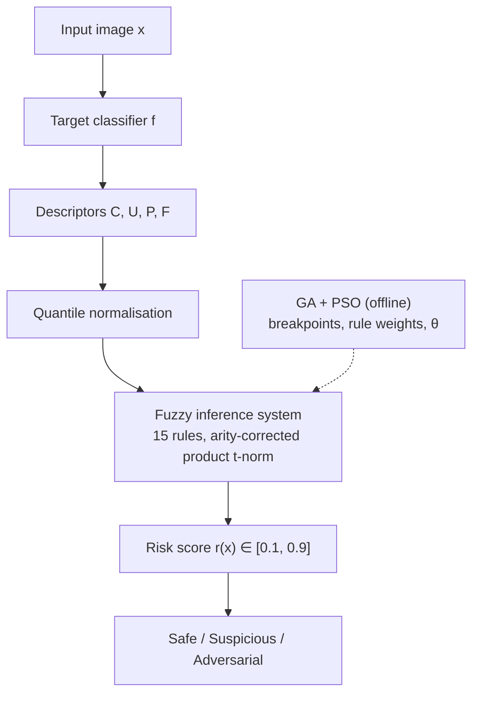

# Adversarial Attack Detection in AI Systems using Genetic Algorithms and Fuzzy Logic

The detector wraps an unmodified neural-network classifier. It computes four inference-time descriptors, fuses them in a 15-rule Mamdani-style fuzzy inference system, and outputs a risk score plus a Safe / Suspicious / Adversarial triage. A real-coded genetic algorithm tunes the membership partition, and particle swarm optimisation tunes the rule weights and the decision threshold.

All the learning components are written directly in NumPy so each one can be audited: the classifier and its input gradients, FGSM, the fuzzy system, the GA and the PSO. scikit-learn is used only to load the dataset, make the stratified split and fit the logistic-regression baseline.



## Quick start

```bash
python3 -m venv .venv
.venv/bin/pip install -r requirements.txt
.venv/bin/python run_experiment.py          # full protocol: 10 seeds per optimiser, ~10 s
.venv/bin/python -m pytest -q               # 76 tests
```

Options: `--seeds N`, `--out DIR`, `--data-seed N` (classifier, attack sampling and split), `--bootstrap N`, `--no-figures`.

Outputs in `results/`:

| File | Contents |
|---|---|
| `report.md` | Tables II, III, V and VI, significance tests, triage, example explanations, comparison with the paper |
| `metrics.json` | Every number in the report, including per-seed metrics |
| `figures/fig2…fig8*.png` | Figures 2–8 of the paper |
| `detector.npz` | The trained detector (classifier, normaliser, tuned FIS) |

## Using the trained detector

```python
from advfuzz.detector import AdversarialDetector

det = AdversarialDetector.load("results/detector.npz")
det.score(X)        # risk score per image (rows of 64 pixels in [0, 1])
det.predict(X)      # 1 = adversarial
det.triage(X)       # "Safe" / "Suspicious" / "Adversarial"
det.explain(X[0])   # descriptors, risk score and the rules that drove it
```

`explain` lists the rules that drove a decision. For example, here is a strong (ε = 4/16) attack that the confidence baseline misses:

```
risk score 0.482 -> ADVERSARIAL   (C = 1.000, U = 4.8e-06, P = 0.001, F = 8.93)
R1: IF C is High and P is Low THEN Safe         share 52%
R9: IF C is High and F is High THEN Adversarial share 48%
```

The model is fully confident, but its internal representation is atypical for the predicted class. This is the signature rule R9 encodes.

## Project layout

| Module | Paper section |
|---|---|
| `advfuzz/data.py` | V.A: UCI digits, stratified 60/40 split |
| `advfuzz/mlp.py` | V.A: 64-64-32-10 ReLU network, Adam, exact input gradients |
| `advfuzz/attack.py` | IV.C.1, Eq. 1: FGSM with valid-image quantisation |
| `advfuzz/descriptors.py` | IV.C.2–3, Eqs. 2–6: C, U, P, F and the quantile normaliser |
| `advfuzz/fuzzy.py` | IV.C.4, Eqs. 7–9, Table II: memberships, rule base, t-norm, defuzzification, triage, explanations |
| `advfuzz/ga.py` | IV.C.5, Algorithm 1: tournament, BLX-α, Gaussian mutation, elitism |
| `advfuzz/pso.py` | IV.C.6, Eq. 10: PSO with inertia decayed linearly from 0.9 to 0.4 |
| `advfuzz/tuning.py` | IV.C.5–7: GA-FIS, PSO-FIS and the GA→PSO hybrid |
| `advfuzz/baselines.py` | Table V: MSP, entropy, kNN distance, logistic regression |
| `advfuzz/metrics.py` | V.B, V.D: metrics, ROC/AUC, exact McNemar, bootstrap |
| `advfuzz/pipeline.py` | IV.B: building the detection dataset (stages i–vii) |
| `advfuzz/detector.py` | Fig. 1: the deployable detector as a fixed function |
| `advfuzz/plots.py` | Figures 2–8 |
| `run_experiment.py` | Runs the whole protocol and writes the report |

## Results

These numbers come from `run_experiment.py` with the default settings. The test split has 527 records. Rows for the optimised methods give the mean ± s.d. over 10 seeds.

| Method | Acc. | Prec. | Rec. | F1 | AUC | Paper F1 |
|---|---|---|---|---|---|---|
| MSP threshold | 0.706 | 0.633 | 0.864 | 0.730 | 0.821 | 0.728 |
| Entropy threshold | 0.706 | 0.633 | 0.864 | 0.730 | 0.821 | 0.722 |
| kNN-distance thr. | 0.837 | 0.796 | 0.868 | 0.831 | 0.921 | 0.846 |
| Logistic regression | 0.837 | 0.803 | 0.856 | 0.829 | 0.922 | 0.852 |
| Expert FIS (untuned) | 0.786 | 0.724 | 0.864 | 0.788 | 0.865 | 0.780 |
| GA-FIS | 0.836 | 0.791 | 0.877 | 0.831 ± 0.005 | 0.879 | 0.841 |
| PSO-FIS | 0.837 | 0.820 | 0.828 | 0.824 ± 0.007 | 0.882 | 0.828 |
| Hybrid GA→PSO | 0.837 | 0.796 | 0.871 | 0.831 ± 0.003 | 0.877 | 0.841 |

For the representative hybrid run (the seed with the best *training* F1):

| Hybrid vs. | McNemar (exact) | Bootstrap ΔF1, 95% CI |
|---|---|---|
| MSP baseline | p = 8.4 × 10⁻¹¹ (95 vs. 25 discordant) | +0.102 [0.065, 0.139] |
| Untuned expert FIS | p = 6.2 × 10⁻⁵ (38 vs. 10) | +0.044 [0.020, 0.067] |

The paper's main findings hold:

- Evolutionary tuning, not the fuzzy formalism alone, produces the gain (0.788 → 0.831 without changing a single rule).
- After normalisation, C and U are perfectly rank-correlated (ρ = −1.000) and C–P is −0.945. F is the only substantially independent channel.
- The fuzzy detector lands within about a point of logistic regression and the kNN-distance threshold. Its contribution is interpretability at roughly equal accuracy.
- At the strongest budget the hybrid holds up better than MSP (0.776 vs. 0.687 recall at ε = 4/16).

The per-budget gap is smaller than the paper's 27 points, though. In this run the hybrid's advantage comes mostly from fewer false positives (52 vs. 122) rather than from catching more attacks. See `results/report.md` for the full comparison.

## Implementation notes

The paper leaves some details open. These are the choices made here:

- **Operating thresholds.** Every baseline's threshold, and the untuned expert FIS's θ, is set to maximise F1 on the detector training split. That is the same criterion the optimisers use, so the comparison is like-for-like.
- **Representative run.** Table VI, the McNemar and bootstrap tests, Table II and Figs. 6–8 use the seed with the best training F1. That seed is chosen without looking at test results.
- **Perturbation response.** The R = 16 noise vectors are drawn once and shared across inputs. P(x), and therefore the whole detector, is then a fixed function of x that does not depend on what else is in the batch.
- **GA mutation σ.** This value is not given in the paper; 0.10 is used.
- **Hybrid PSO stage.** It starts from a fresh random swarm, as the paper's Fig. 5 implies. Seeding a particle with the GA solution was tested and gives the same test F1.
- **No-rule-fires case.** The partition is complete, but the rule base does not cover every combination of terms (e.g. C Low, U Low, P Low, F High fires nothing). Such inputs score 0.5. No test input hits this case.
- **Triage.** Scores below θ are accepted (Safe). Flagged scores go to screening (Suspicious) unless they reach the midpoint between θ and the Adversarial consequent 0.9, where they are rejected (Adversarial).
- **Quantisation.** Every budget is a multiple of 1/16, so x ± ε already lies on the 17-level grid. The quantisation step therefore moves no pixels at these budgets (the report checks this). It only matters for budgets off the grid.
